## 开始之前...

> [!IMPORTANT] 重要
> **本站通过 Netlify 部署，可自定义域名，全程不会产生任何费用消耗**
>
> **如果你打算将 Firefly 模板部署到自己的服务器上，那本文可能无法为你提供一个可靠的解决方案**

**请注意自己的node.js与pnpm版本**
- node.js >= 22
- pnpm >= 9

**Firefly 模板作者仓库及相关文档**

可以在 [Firefly Docs](https://docs-firefly.cuteleaf.cn/zh/) 查看官方使用说明，下方是 Firefly 仓库

::github{repo="CuteLeaf/Firefly"}

<i style="color:#FF69B4;">仓库打不开的话考虑一下科学上网喵~</i>

## 克隆本地仓库，运行项目

### 2.1 点击右上角 Fork 按钮，将项目复制到自己的仓库中。（记得点击 Star 支持作者哦~）

<i style="color:#FF69B4;">给自己的仓库起一个好听的名字吧~</i>

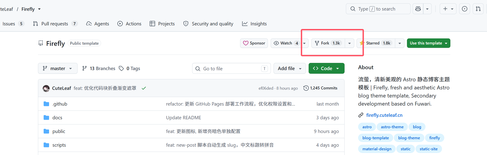

### 2.2 复制到新仓库后，选择自己喜欢的方式，复制仓库克隆地址
- 使用 HTTPS 协议克隆 github 仓库时，每次克隆都需要输入账号密码进行验证
- 使用 SSH 协议在本地配置好秘钥后可以免密操作

如果不考虑长时间使用 github 可以直接使用 HTTPS 协议克隆，然后将项目推送到 Gitee 或其他代码管理工具中

这里我选择 SSH 协议

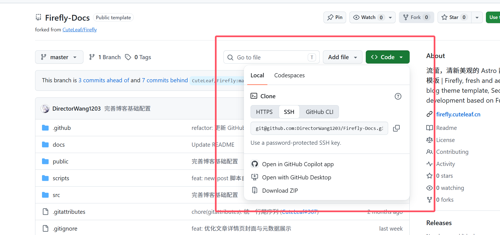

### 2.3 在本地找一个合适的位置，右键打开终端（或在文件夹目录栏中输入 cmd，回车唤出命令行）

执行以下指令，仓库克隆地址为 **2.2** 复制的地址

```bash
git clone 你的仓库克隆地址
```

### 2.4 克隆完成后继续以下操作安装项目所需依赖

```bash
# 进入项目目录
cd Firefly

# 如果没有安装pnpm，先安装
npm install -g pnpm

# 安装项目依赖
pnpm install
```

这里如果使用的不是官方源可能会报错，提示找不到依赖包，若依赖成功安装则跳过此步

```bash
# 临时使用官方源安装
pnpm install --registry=https://registry.npmjs.org/
```

### 2.5 运行项目

```bash
# 本地项目运行指令，项目默认端口4321
pnpm dev
```

出现本地地址就意味着项目启动成功了，按住 ctrl 键单击地址即可在浏览器中打开

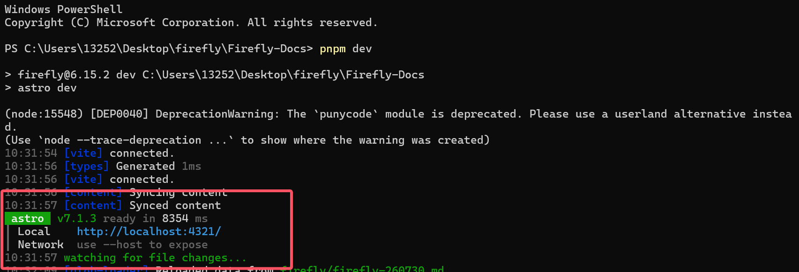

## 项目基础配置

浏览器加载完毕后，即可看到以下画面，由于版本与配置不同，启动后的样式可能与博主不同，下面介绍如何修改项目配置


项目中所有的配置文件均保存在 **src/config** 目录下，作者对配置文件的注释非常清晰，可以对照自行修改

点击 [配置文件概览](https://docs-firefly.cuteleaf.cn/zh/guide/getting-started.html#%E9%85%8D%E7%BD%AE%E6%96%87%E4%BB%B6%E6%A6%82%E8%A7%88) 以查看各文件对应的配置项内容

> [!NOTE] 提示
> **无重点的项目配置将会跳过，以下仅针对部分难点配置进行说明**

### 3.1 评论系统 config/commentConfig.ts

评论系统博主选择使用 twikoo ，这里也是博主首次使用该系统，其他的几款评论系统也均为使用过，无法给出差异性对比

以下是博主的评论系统配置

```typescript
// config/commentConfig.ts
export const commentConfig: CommentConfig = {
    type: "twikoo",
    
    twikoo: {
        // envId需要使用自己配置的地址
        envId: "https://**********************/.netlify/functions/twikoo",
        lang: "zh-CN",
        visitorCount: true,
        // 这里的jsUrl是 Twikoo JS 文件地址的安装地址，可以根据自身网络情况选择，可选项在配置文件中已给出
        jsUrl: "https://cdn.jsdelivr.net/npm/twikoo@1.7.14/dist/twikoo.min.js",
        cssUrl: "/assets/css/twikoo-custom.css",
    },
}
```

接下来将会重点解决envId的问题，我们要使用到以下几个网站
- [MongoDB](https://account.mongodb.com/)
- [twikoo-netlify](https://github.com/twikoojs/twikoo-netlify)
- [Netlify](https://app.netlify.com/)

这里我们将会使用 Netlify 来部署 twikoo 服务 ，顺带一提，博主目前的站点也是使用 Netlify 部署的，它将在未来起到很大的作用

#### 3.1.1 部署 MongDB 数据库

打开 [MongoDB](https://account.mongodb.com/) 进行账号注册
- 如果使用github登录，github账号必须绑定邮箱，且不建议使用QQ邮箱，可能会直接报错
- 不使用github账号，可以直接使用邮箱进行注册，这里博主使用163邮箱进行注册，这一步需要大家各显神通了~

注册好后可以跟着系统提示继续创建数据库，也可以跟着博主的步骤继续

在 MongoDB 的项目主页中，点击右上角 New Project 新建项目，需要取一个不重复的项目名，添加成员时无需操作，当前账号默认为成员

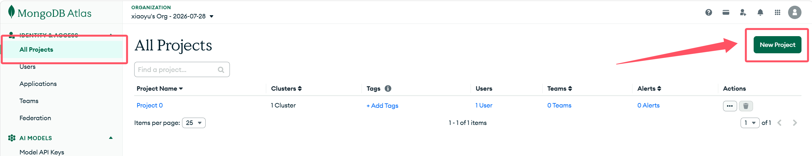

创建项目后会跳转至项目详情，如下图

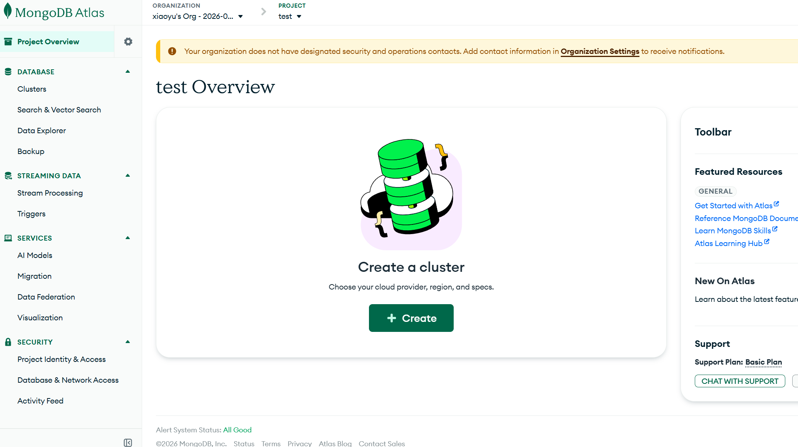

点击中间的 Create 按钮，按照下图所示，选择免费数据库，提供商选择aws，地区选择Oregon（以上为 twikoo 官方推荐配置，博主个人体验还可以，挺流畅的）

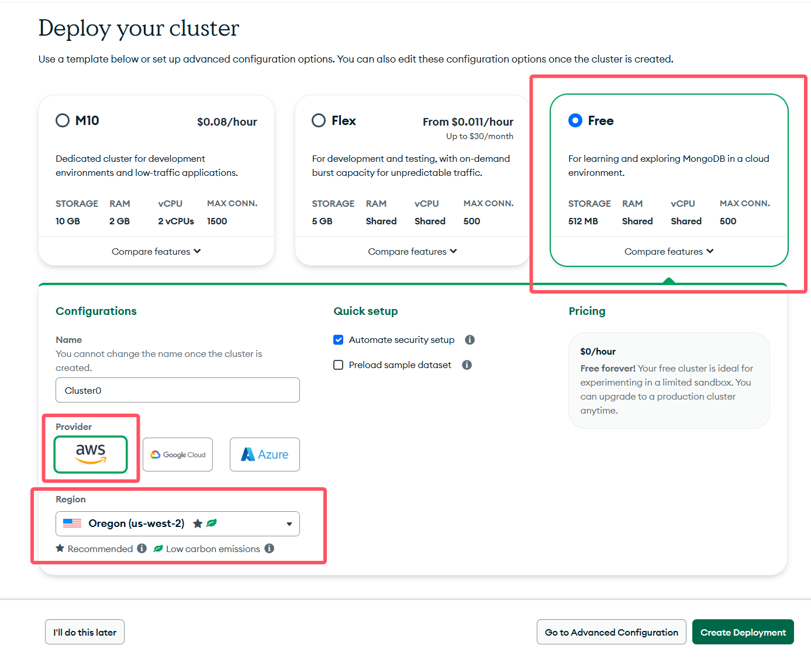

部署成功后会弹出一个弹窗，如下图，**将红框中的用户名及密码保存好**，点击右下角按钮继续

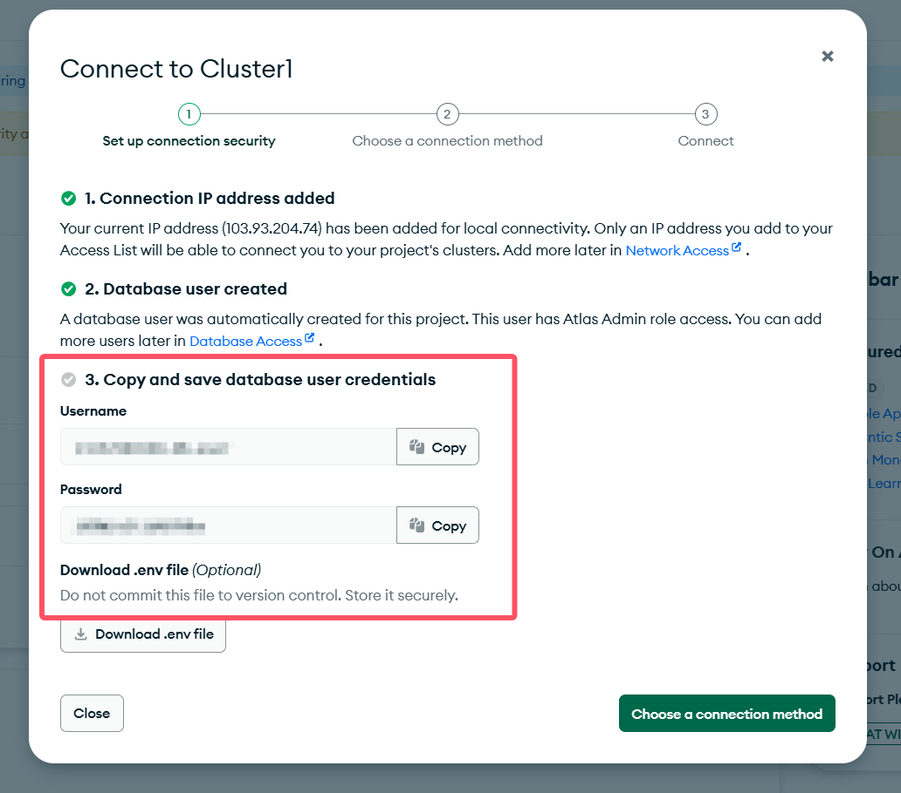

连接方式选择第一个 **Drivers**，进入最后一步，页面如下，**将红框中的数据库连接字符串保存好，并将其中的username和password替换为上文保存的用户名及密码**

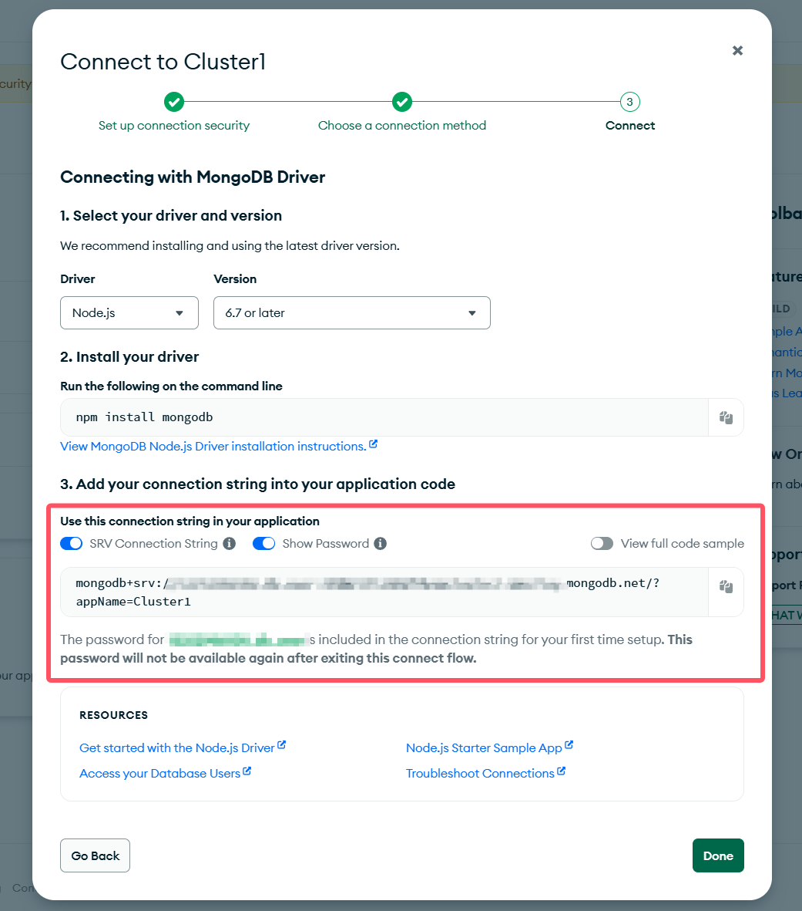

最后需要设置数据库网络白名单，由于 Netlify 的出口地址不固定，所以我们选择 0.0.0.0/0 允许所有IP地址的连接，流程如下

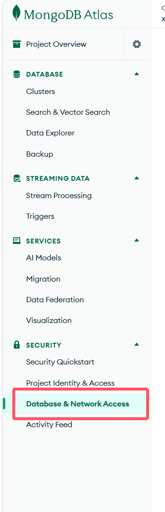

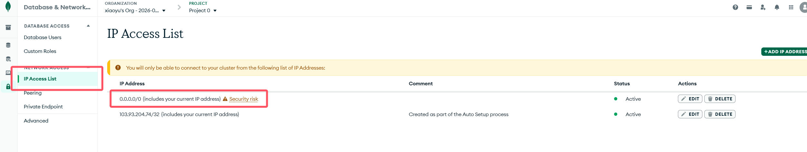

获取到数据库连接字符串，开放允许连接的IP地址，至此，我们完成了 MongoDB 数据库的部署

<i style="color:#FF69B4;">别怕，最复杂的部分已经过去，评论系统的配置马上就要完成了~</i>

#### 3.1.2 部署 Twikoo 评论系统

打开 Twikoo 的 github 仓库，Fork 复制到自己的账号下，然后打开 [Netlify](https://app.netlify.com/) 进行账号注册

::github{repo="twikoojs/twikoo-netlify"}

Netlify 账号注册好后，根据提示创建一个 Team ，然后点击右上角 new Project 创建新项目，跳转页面，如下图

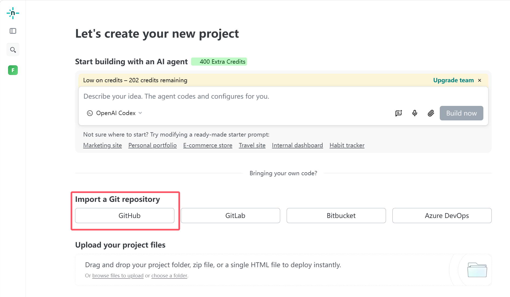

点击 GitHub 按钮，从 GitHub 中导入项目，将刚刚复制好的仓库导入到 Netlify 中

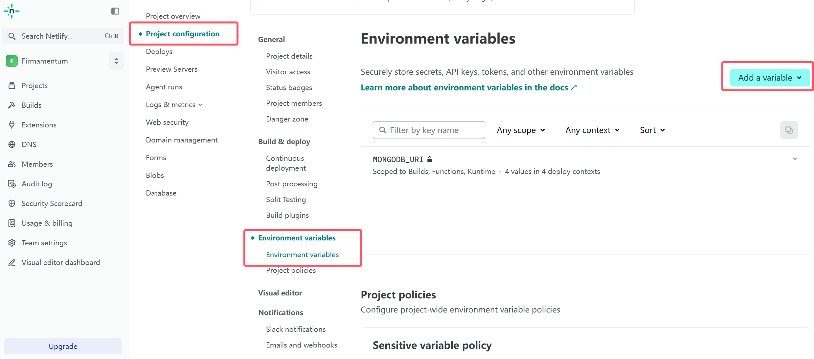

按照上图提示，进入环境变量配置部分，点击右上角按钮，选择 Add a single variable

环境变量 key 值固定为 **MONGODB_URI** ，勾选为私密值，下方配置项填入 **3.1.1** 中保存的数据库连接字符串

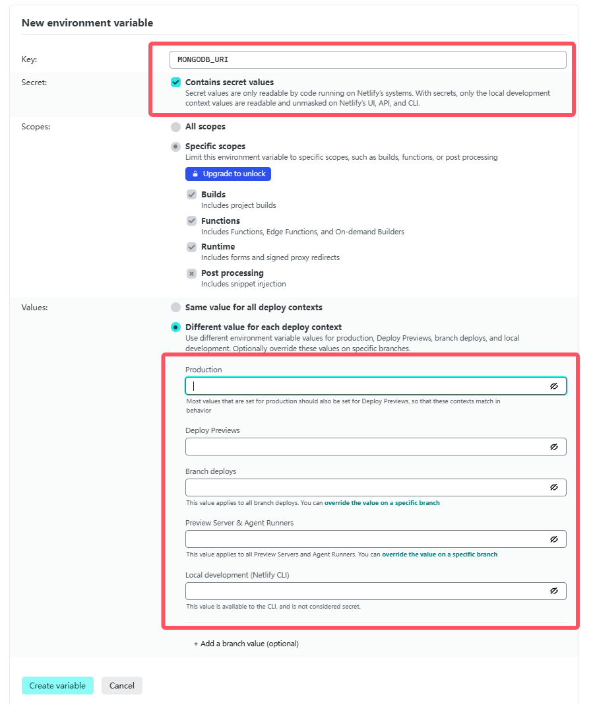

保存后我们前往部署页面，重新部署项目，箭头所指即为 Netlify 部署后提供的地址

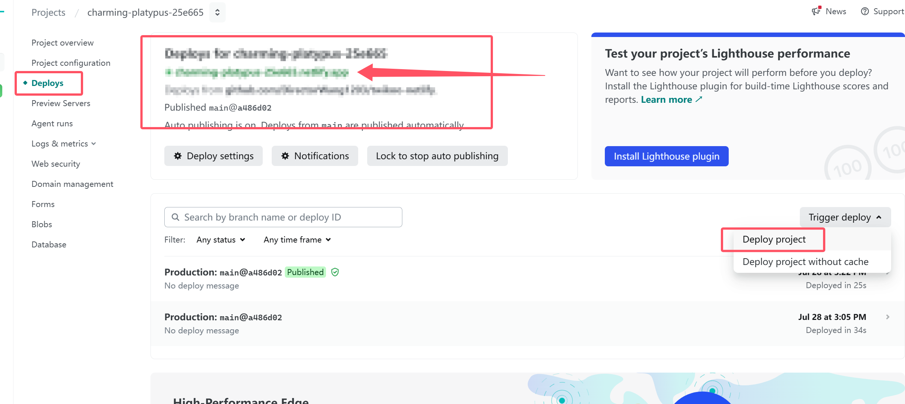

待项目部署完毕后，点击 Netlify 提供的地址前往测试，得到如下反馈，证明 Twikoo 评论系统部署成功

```bash
{
  "code": 100,
  "message": "Twikoo 云函数运行正常，请参考 https://twikoo.js.org/frontend.html 完成前端的配置",
  "version": "1.7.15"
}
```

#### 3.1.3 修改 firefly 项目配置

使用 Netlify 的线上地址替换项目中的配置

```typescript
// config/commentConfig.ts
export const commentConfig: CommentConfig = {
    type: "twikoo",
    
    twikoo: {
        // envId需要使用自己配置的地址
        envId: "https://{你的 twikoo 部署地址}/.netlify/functions/twikoo",
        ...
    },
}
```

重启项目，评论系统配置完毕

<i style="color:#FF69B4;">当时部署的时候感觉模棱两可的，说实话重来一遍感觉思路彻底清晰了，即使有过一次经验，整理的时候还是有点困难啊（长叹一口气）</i>

### 3.2 友链 content/spec/friends.mdx

此处的友链配置作用于友链板块下方申请友链的部分，以下是博主的配置

```javascript
// content/spec/friends.mdx
export const site = {
    name: "Firmamentum-苍穹",
    desc: "Dr王主任的个人博客，分享计算机技术、游戏、书籍和生活中的点点滴滴。",
    url: "https://www.firmamentum.cn",
    avatar: "https://weavatar.com/avatar/1cebad907d16388f576ae37f1b9e38cb7637eee3978701fe50be89edfea69f14",
    email: "13252986508@163.com",
};
```

这里主要说明一下头像的设置，可以通过 [WeAvatar 免费网络资料卡](https://weavatar.com/) 设置免费的在线头像，博主的头像链接就是借助该网站生成

<i style="color:#FF69B4;">感兴趣的话希望能够添加我的友链哦~</i>

## 项目部署

本站使用 Netlify 部署，因此评论系统中提到的 Netlify 又要登场了，下文我们将会使用 Netlify 进行 Firefly 项目的部署

如果你没有 Netlify 的账号，可以在 [Netlify](https://app.netlify.com/) 进行账号注册

Netlify 账号注册好后，根据提示创建一个 Team ，然后点击右上角 new Project 创建新项目，跳转页面，如下图


点击 GitHub 按钮，从 GitHub 中导入项目，将刚刚复制好的仓库导入到 Netlify 中

导入完成后，进入环境变量配置部分，点击右上角按钮，选择 Add a single variable

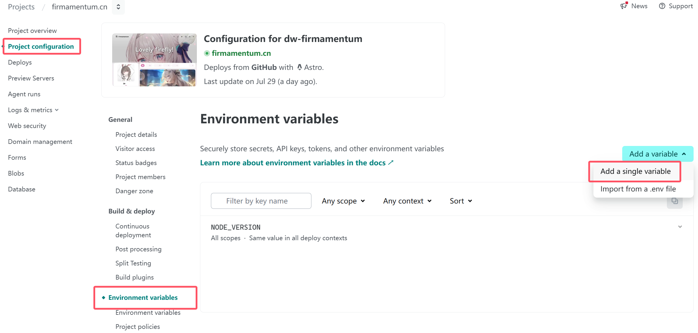

环境变量 key 值固定为 **NODE_VERSION** ，值为22，实测不配置也没有关系

配置好环境变量后，选择 Project configuration -> Build & deploy 按照下图进行构建配置，需要设置 Build command 与 Publish directory

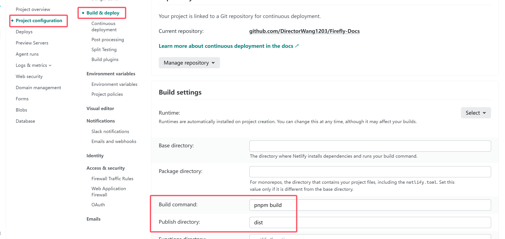

全部配置完毕后，点击左侧 Deploys 进入部署页面，右侧下拉框选择 Deploy project 重新部署项目

部署完毕后，点击左侧 Domain management 进入域名管理页面，可以查看 Netlify 为你分配的域名

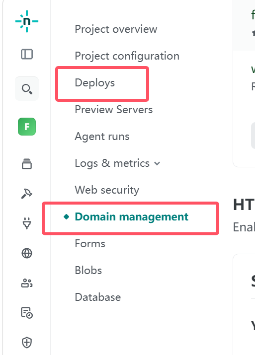

如果你有自己的域名和证书，也可以在此处进行设置
- Production domains 可设置你的自定义域名，需要在域名控制台中将 DNS 服务器切换为 Netlify DNS 才会生效，具体配置需要可以点击域名后的 Netlify DNS 进行查看
- HTTPS 可以设置你的安全证书，上传后 Netlify 将会自动配置与签发证书链

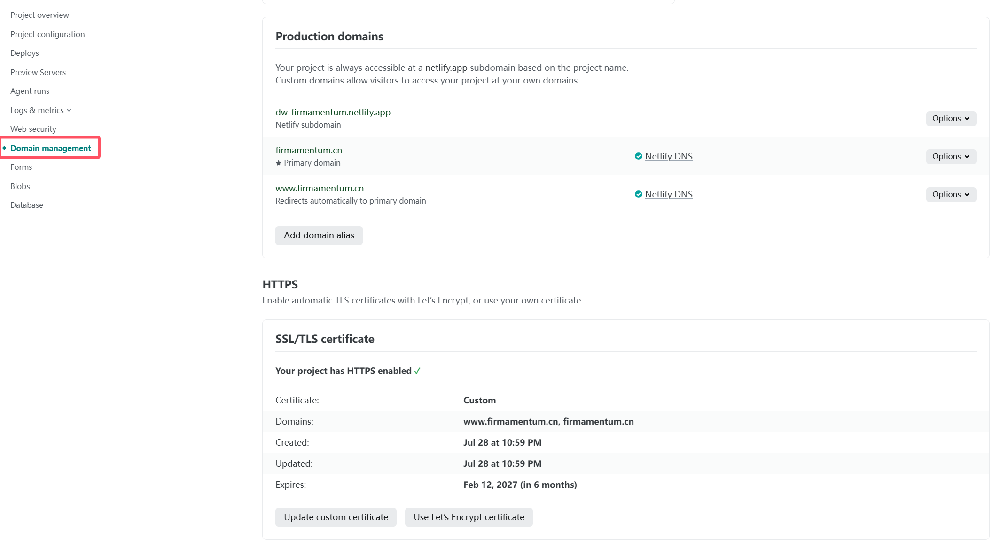

Netlify 会自动监听 GitHub 更新，后续只需推送仓库，即可实现 Netlify 自动部署，无需手动管理

至此，Firefly 模板的部署已初步完成，新世界的大门已为你展开

<i style="color:#FF69B4;">终于结束了呢，自己写完这么一整篇文章...你有好好地跟上嘛？希望我的文章能够为你带来帮助，哪里不懂的也可以向我提问哦...不行了真的好累好累，要休息了~</i>